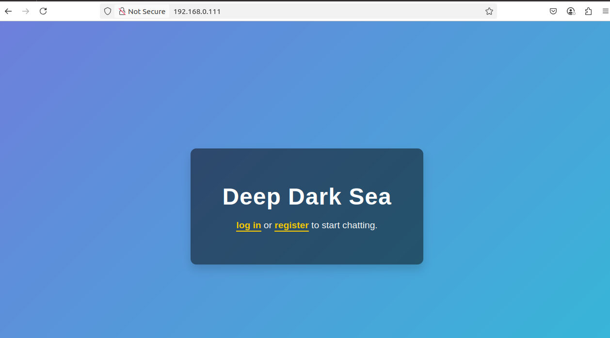
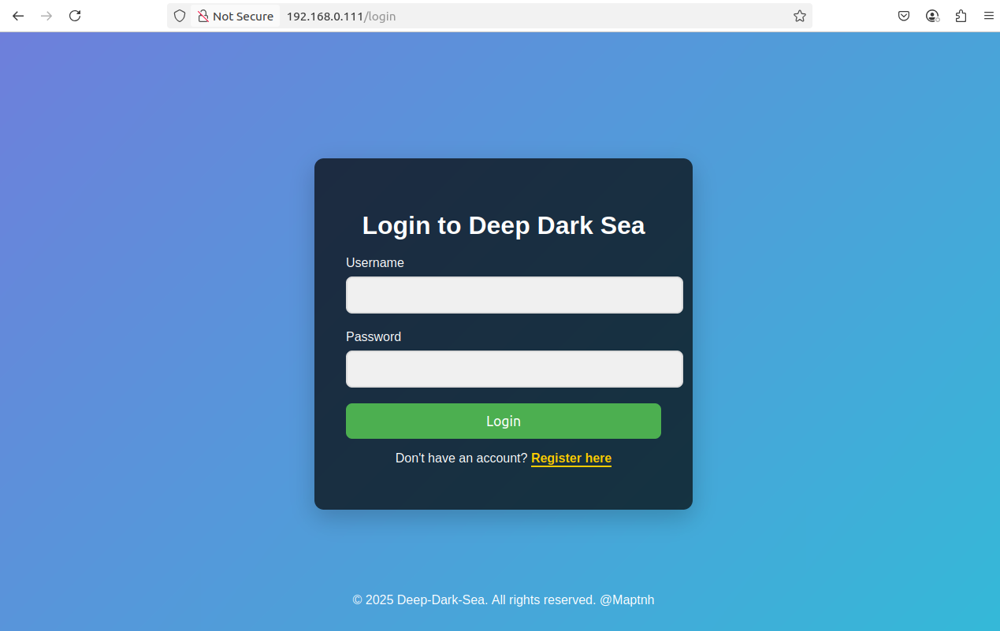
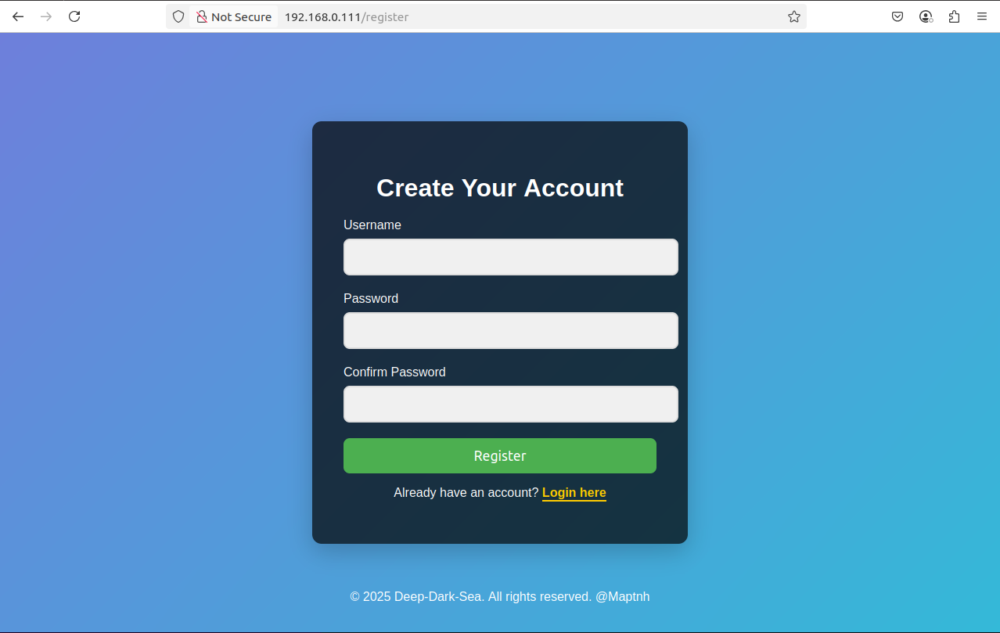
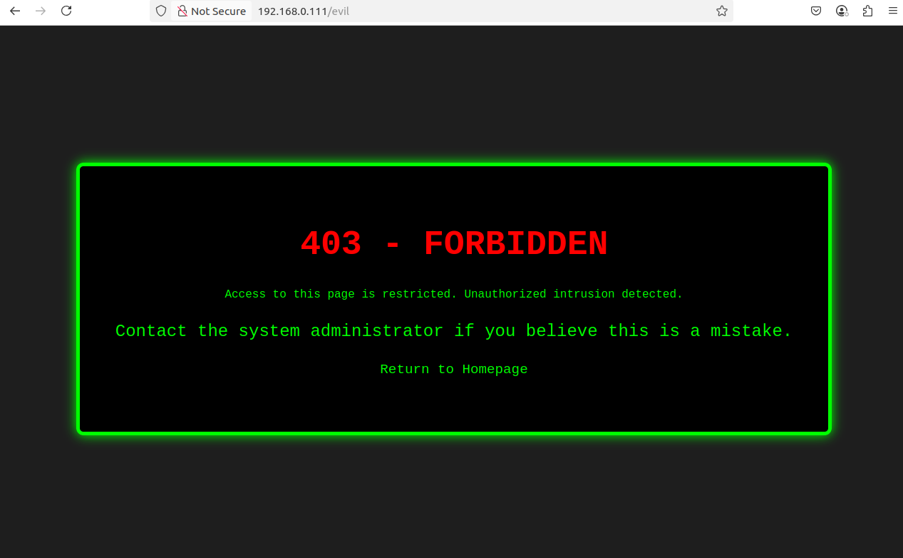
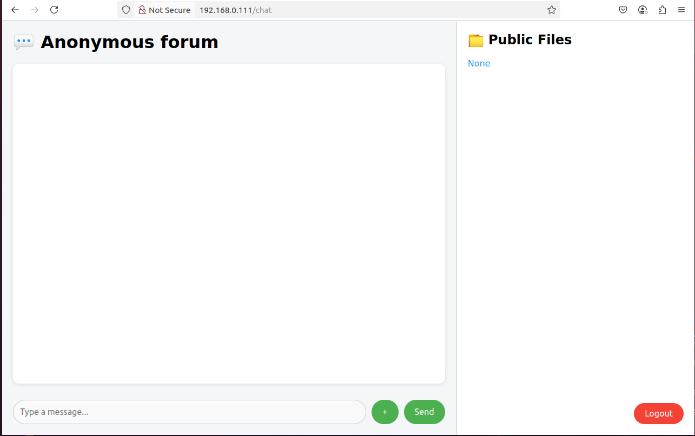
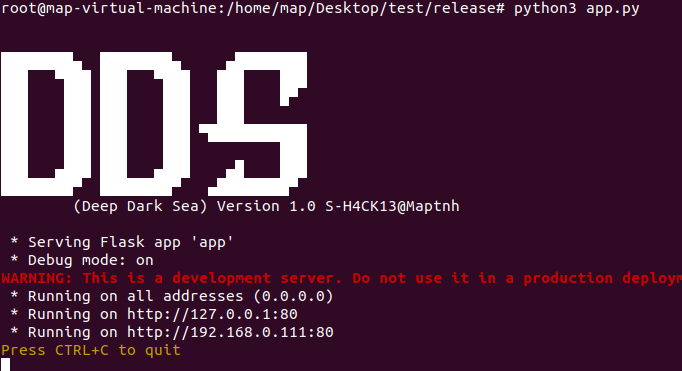
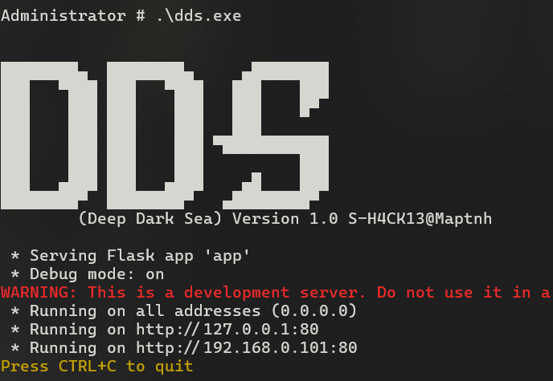

 

# Deep Dark Sea

This is a Flask application for LAN-based file sharing and real-time anonymous chatting.

**Features:**
1. Anonymous real-time chat
2. Upload and download any files
3. No database deployment required
4. Identity authentication protection

---



---



---



---



---



**Upload Files**

# Linux

```bash
$ pip install Flask Flask-SQLAlchemy Flask-SocketIO werkzeug
$ sudo python3 app.py
```

---



# Windows Executable

```bash
Administrator > .\dds.exe
```

---



 